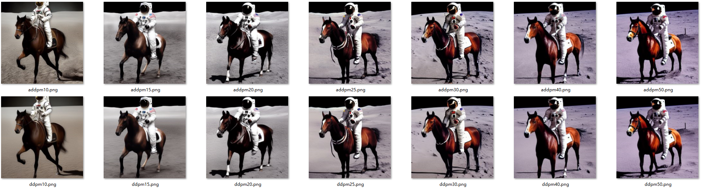
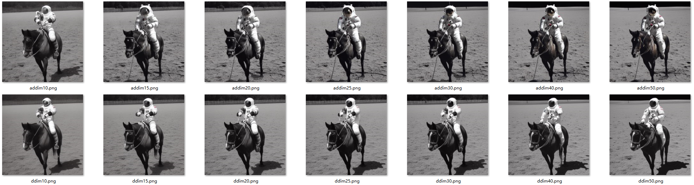

## Generate samples on Stable Diffusion with Analytic-DPM





I briefly try Analytic-DPM on Stable Diffusion. It looks that Analytic-DPM has more details in the image background than DDPM/DDIM.

## Run
```
python convert_ckpt.py  # split the Stable Diffusion checkpoint sd-v1-4-full-ema.ckpt
python txt2img.py  # see generated samples in "outputs" directory
```


